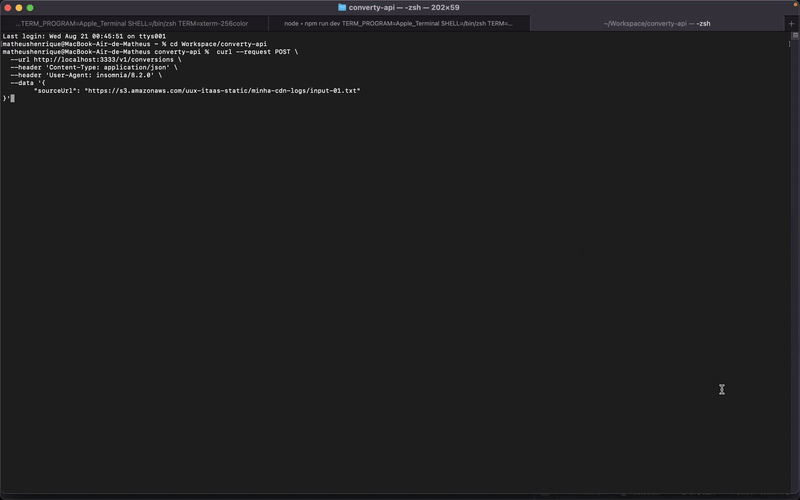

# Converty API

The Converty API is a tool designed to convert log files from the **Minha CDN** format to the **Agora** format.

## Techs

- [Adonis.js](https://adonisjs.com) - Backend framework
- [Firebase](https://firebase.google.com) - Managed infrastructure
- [Typescript](https://www.typescriptlang.org) - Typed JavaScript for better development experience
- [ESLint](https://eslint.org) - Code quality and formatting
- [Docker](https://www.docker.com) - Containerization for consistent environments

### Prerequisites

Make sure you have the following dependencies installed on your system:

```sh
Docker >= 23.0.5
Docker Compose >= 2.17.3
```

## Project Setup

1. Clone this repository.
2. Copy the `.env.example` file to `.env`

```sh
cp .env.example .env
```

## Running The Application

Start the development server using Docker Compose.

```sh
docker compose up
```

## Testing The Application

You can test the endpoint with the following request.

```sh
 curl --request POST \
  --url http://localhost:3333/v1/conversions \
  --header 'Content-Type: application/json' \
  --header 'User-Agent: insomnia/8.2.0' \
  --data '{
        "sourceUrl": "https://s3.amazonaws.com/uux-itaas-static/minha-cdn-logs/input-01.txt"
}'
```

### Type-Check, Compile and Minify for Production

To prepare the project for production, run:

```sh
docker exec -it converty-api npm run build
```

## Demo


